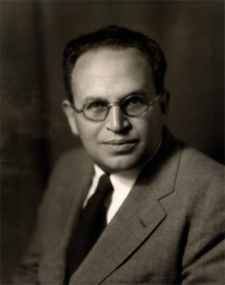

```{r setup, include=FALSE}
knitr::opts_chunk$set(echo = FALSE)
```

## A quoi sert la sociologie électorale ? {.flexbox .vcenter}

<div class="centered">
[](http://www.diploweb.com/Y-Lacoste-La-geographie-ca-sert-d.html)
</div>

## Un initiateur mythique {.flexbox .vcenter}

<div class="centered">
[](http://www.sciencespo.fr/stories/#!/fr/frise/2/tableau-politique-de-la-france-de-l-ouest/)
</div>

## Une trajectoire singulière  {.flexbox .vcenter}

- Un candidat malheureux
- devenu un grand intellectuel
- dont l'œuvre la plus célèbre est marginale

- > [Article de Garrigou](http://www.persee.fr/web/revues/home/prescript/article/arss_0335-5322_1995_num_106_1_3133)

- > [Article de Veitl et Blondiaux](http://www.persee.fr/web/revues/home/prescript/article/genes_1155-3219_1999_num_37_1_1592)

## La naissance américaine des études électorales {.flexbox .vcenter}

- Contexte d'autonomisation universitaire : Chicago, années 1920 et 1930
- Merriem, Gosnell...
- Mise en doute de la théorie démocratique

## L'ambiguïté Lazarsfeld {.flexbox .vcenter}

<div class="centered">

</div>

- > *the methodological equivalence of socialist voting and the buying of soap*
- la préorientation sociale des votes

## Pourquoi faire de la sociologie électorale ?

- Des débats scientifiques partiellement encastrés dans les débats sociaux et politiques
- Mais un fait social passionnant, mystérieux et révélateur (mais de quoi ?)

## Logistique 

- Chaque cours : un support de cours (slides), un "encadré" (zoom sur un auteur, une théorie), et une section "méthodes et données" (la recherche empirique en action)
- Des lectures obligatoires et recommandées : une lecture obligatoire avant chaque cours, des recommandations qui émaillent le cours. Fiche de synthèse d'une page (dactylographiée) obligatoire à chaque cours, j'en note deux par cours.
- Un travail final : dossier documentaire d'une dizaine de pages qui fait l'état des connaissances sur un sujet au choix. À rendre lors de la dernière séance. 

## Manuels recommandés 

- Olivier Ihl, *Le vote*, coll. "Clefs", Paris, Montchrestien, 2000.
- Patrick Lehingue, *Le vote*, Paris, La Découverte, 2011.
- Nonna Mayer, *Sociologie des comportements politiques*, Paris, Armand Colin, 2010.

## Un site support 

<http://joelgombin.fr/teaching/socioelectorale/>